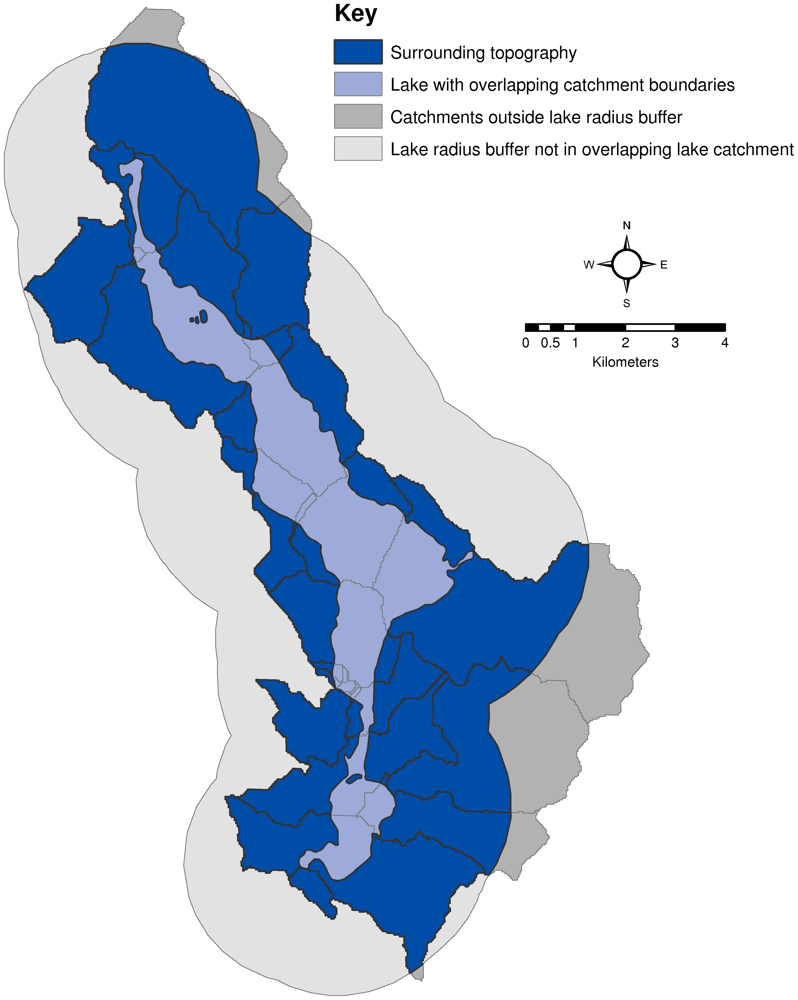
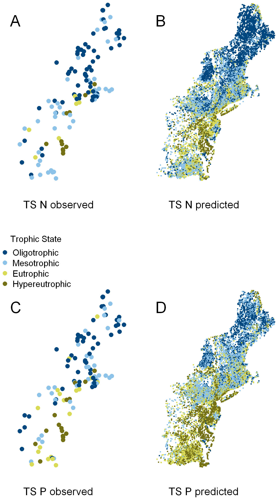
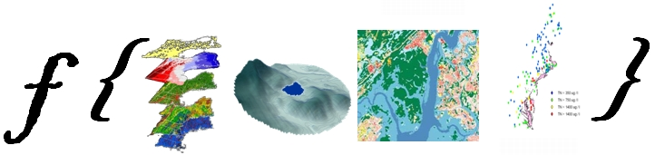

## Basics on Depth

--- .segue bg:url(assets/img/Pooecetes_gramineus_-USA-8_small.jpg)

## Extending USGS SPARROW

--- &twocol w1:40% w2:60%

## USGS SPARROW

***=left
- Nutrient Load Model
- Multiple Scales
 - National Scale
 - Regional Scale

***=right

--- &twocol w1:38% w2:60%

## USEPA Modeling

***=left
- Concentrations in Lakes
 - SPARROW Assumes a Flat Lake
- Our Addition
 - Modeled Residence Time: [Milstead et al. 2013](http://www.plosone.org/article/info%3Adoi%2F10.1371%2Fjournal.pone.0081457) 

***=right
<table><colgroup span="1"><col span="1"><col span="1"><col span="1"><col span="1"><col span="1"><col span="1"><col span="1"></colgroup><thead><tr><th colspan="1" rowspan="1"></th><th colspan="3" rowspan="1"><strong>Nitrogen Results</strong></th><th colspan="3" rowspan="1"><strong>Phosphorus Results</strong></th></tr><tr><th colspan="1" rowspan="1"><strong>Hypothesis</strong></th><th colspan="1" rowspan="1"><strong>rmse</strong></th><th colspan="1" rowspan="1"><strong>adjR2</strong></th><th colspan="1" rowspan="1"><strong>aic</strong></th><th colspan="1" rowspan="1"><strong>rmse</strong></th><th colspan="1" rowspan="1"><strong>adjR2</strong></th><th colspan="1" rowspan="1"><strong>Aic</strong></th></tr></thead><tbody><tr><td colspan="1" rowspan="1">H0</td><td colspan="1" rowspan="1">0.26</td><td colspan="1" rowspan="1">0.43</td><td colspan="1" rowspan="1">24.7</td><td colspan="1" rowspan="1">0.43</td><td colspan="1" rowspan="1">0.35</td><td colspan="1" rowspan="1">154.3</td></tr><tr><td colspan="1" rowspan="1">H1</td><td colspan="1" rowspan="1">0.31</td><td colspan="1" rowspan="1">0.53</td><td colspan="1" rowspan="1">21.4</td><td colspan="1" rowspan="1">0.47</td><td colspan="1" rowspan="1">0.45</td><td colspan="1" rowspan="1">141.9</td></tr><tr><td colspan="1" rowspan="1">H2</td><td colspan="1" rowspan="1">0.28</td><td colspan="1" rowspan="1">0.43</td><td colspan="1" rowspan="1">8.7</td><td colspan="1" rowspan="1">0.46</td><td colspan="1" rowspan="1">0.30</td><td colspan="1" rowspan="1">152.7</td></tr><tr><td colspan="1" rowspan="1">H3</td><td colspan="1" rowspan="1">0.31</td><td colspan="1" rowspan="1">0.48</td><td colspan="1" rowspan="1">6.2</td><td colspan="1" rowspan="1">0.48</td><td colspan="1" rowspan="1">0.38</td><td colspan="1" rowspan="1">158.2</td></tr><tr><td colspan="1" rowspan="1">H4</td><td colspan="1" rowspan="1">0.27</td><td colspan="1" rowspan="1">0.51</td><td colspan="1" rowspan="1">-8.4</td><td colspan="1" rowspan="1">0.44</td><td colspan="1" rowspan="1">0.42</td><td colspan="1" rowspan="1">141.6</td></tr><tr><td colspan="1" rowspan="1">H5</td><td colspan="1" rowspan="1">0.28</td><td colspan="1" rowspan="1">0.49</td><td colspan="1" rowspan="1">4.0</td><td colspan="1" rowspan="1">0.44</td><td colspan="1" rowspan="1">0.40</td><td colspan="1" rowspan="1">140.2</td></tr>

<tr style="background: #559b6a; color: white;"><td colspan="1" rowspan="1" style="color: white;">H6</td><td colspan="1" rowspan="1"><strong>0.21</strong></td><td colspan="1" rowspan="1"><strong>0.62</strong></td><td colspan="1" rowspan="1"><strong>-69.9</strong></td><td colspan="1" rowspan="1"><strong>0.36</strong></td><td colspan="1" rowspan="1"><strong>0.54</strong></td><td colspan="1" rowspan="1"><strong>94.1</strong></td></tr>

<tr><td colspan="1" rowspan="1">H7</td><td colspan="1" rowspan="1">0.27</td><td colspan="1" rowspan="1">0.52</td><td colspan="1" rowspan="1">-5.1</td><td colspan="1" rowspan="1">0.44</td><td colspan="1" rowspan="1">0.41</td><td colspan="1" rowspan="1">142.0</td></tr><tr><td colspan="1" rowspan="1">H8</td><td colspan="1" rowspan="1">0.27</td><td colspan="1" rowspan="1">0.52</td><td colspan="1" rowspan="1">-4.6</td><td colspan="1" rowspan="1">0.44</td><td colspan="1" rowspan="1">0.42</td><td colspan="1" rowspan="1">142.3</td></tr></tbody></table>

--- &twocol w1:50% w2:50%

## Modeled Trophic State

***=left

- Predictions
 - TN
 - TP
 - Chl *a*

***=right

--- &twocol w1:40% w2:60%

## Availability

***=left
- Morphometry:
  - Draft for Conterminus US
  - Validation ongoing
  
- Trophic State:
 - New England - HUC01
 - Mid-Atlantic - HUC02

***=right

--- .segue bg:url(http://www.pca.state.mn.us/artwork/newscenter/tab-littlerocklake.jpg)

## Cyanobacteria

--- 

## Our Project

 > We are trying to combine what we know from field data, 
 > what we know from modeled data, and what we (think) we know
 > about cyanobacteria and create predicitve models of the 
 > probability of bloom events.
 

--- .segue bg:url(assets/img/DSC00195.jpg)

## Thanks and Questions

Photo Credit: URI Watershed Watch

