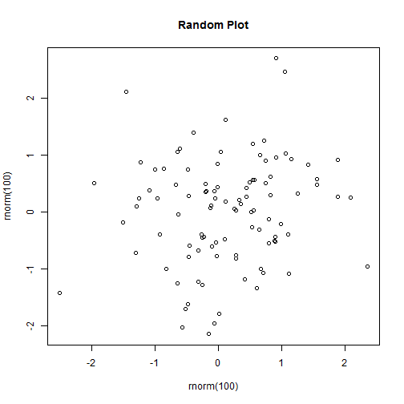

## Overview

1. Lake Morphometry
2. USGS Sparrow
3. Modeling TN, TP, and Chl a concentrations

 


--- 

## Lake Morphometry

> - Northeastern US
 > 1. Volume
 > 2. Depth
> - Rest of Country
 > 1. Full Suite of Lake Morphometry
 > - list those here
 
And here is an attempt to output a formatted data.frame

```
## Error: could not find function "kable"
```


---

## USGS SPARROW

- Nutrient Load Model
- Multiple Scales
 1. National Scale
 2. Regional Scale
- Concentrations

---

## Modeling Summertime TN, TP and Chl a Concentration

Column X | Column Y
---------|----------
Row 1    | Row 1
Row 2    | Row 2
Row 3    | Row 3

--- &twocol w1:40% w2:60%

## Two Column Layout   


***=left

- This is stuff
- This is more stuff

***=right


---

## Availability

--- .segue bg:url(http://www.pca.state.mn.us/artwork/newscenter/tab-littlerocklake.jpg)

<hgroup>
  <h2 style="color:#4A5B64">Cyanobacteria</h2>
</hgroup>


